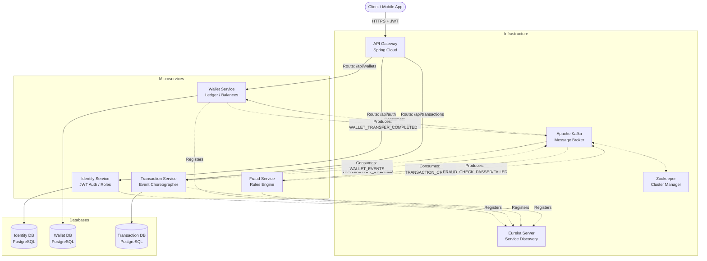

```mermaid
flowchart TD
    Client([Client / Mobile App])
    
    subgraph Infrastructure
        Gateway[API Gateway<br/>Spring Cloud]
        Registry[Eureka Server<br/>Service Discovery]
        Kafka[Apache Kafka<br/>Message Broker]
        Zookeeper[Zookeeper<br/>Cluster Manager]
    end
    
    subgraph Microservices
        Identity[Identity Service<br/>JWT Auth / Roles]
        Wallet[Wallet Service<br/>Ledger / Balances]
        Transaction[Transaction Service<br/>Event Choreographer]
        Fraud[Fraud Service<br/>Rules Engine]
    end
    
    subgraph Databases
        DB_Id[(Identity DB<br/>PostgreSQL)]
        DB_Wal[(Wallet DB<br/>PostgreSQL)]
        DB_Tx[(Transaction DB<br/>PostgreSQL)]
    end
    
    %% Traffic Routing
    Client -->|HTTPS + JWT| Gateway
    Gateway -->|Route: /api/auth| Identity
    Gateway -->|Route: /api/wallets| Wallet
    Gateway -->|Route: /api/transactions| Transaction
    
    %% Service Discovery Registration
    Identity -.->|Registers| Registry
    Wallet -.->|Registers| Registry
    Transaction -.->|Registers| Registry
    Fraud -.->|Registers| Registry
    Kafka <-.-> Zookeeper
    
    %% Database Connections
    Identity --> DB_Id
    Wallet --> DB_Wal
    Transaction --> DB_Tx
    
    %% Asynchronous Event Choreography (Kafka)
    Transaction -.->|Produces: TRANSACTION_CREATED| Kafka
    Kafka -.->|Consumes: TRANSACTION_CREATED| Fraud
    Fraud -.->|Produces: FRAUD_CHECK_PASSED/FAILED| Kafka
    Kafka -.->|Consumes: FRAUD_EVENTS| Wallet
    Wallet -.->|Produces: WALLET_TRANSFER_COMPLETED| Kafka
    Kafka -.->|Consumes: WALLET_EVENTS| Transaction

```