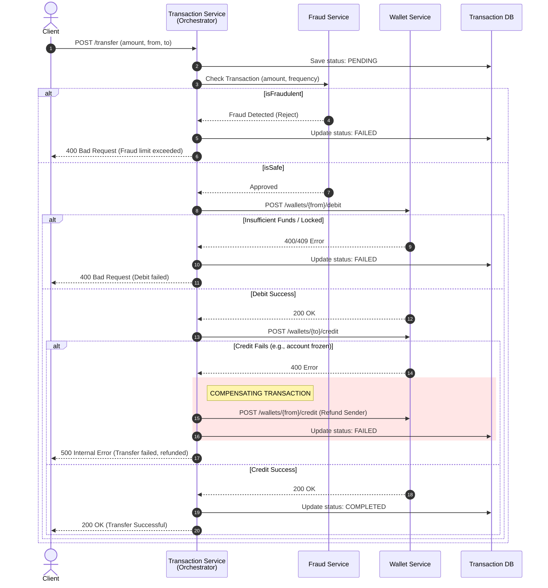

```mermaid
sequenceDiagram
    autonumber
    actor Client
    participant TS as Transaction Service<br/>(Orchestrator)
    participant FS as Fraud Service
    participant WS as Wallet Service
    participant DB as Transaction DB

    Client->>TS: POST /transfer (amount, from, to)
    TS->>DB: Save status: PENDING
    
    %% Step 1: Fraud Check
    TS->>FS: Check Transaction (amount, frequency)
    alt isFraudulent
        FS-->>TS: Fraud Detected (Reject)
        TS->>DB: Update status: FAILED
        TS-->>Client: 400 Bad Request (Fraud limit exceeded)
    else isSafe
        FS-->>TS: Approved
        
        %% Step 2: Debit Sender
        TS->>WS: POST /wallets/{from}/debit
        alt Insufficient Funds / Locked
            WS-->>TS: 400/409 Error
            TS->>DB: Update status: FAILED
            TS-->>Client: 400 Bad Request (Debit failed)
        else Debit Success
            WS-->>TS: 200 OK
            
            %% Step 3: Credit Receiver
            TS->>WS: POST /wallets/{to}/credit
            alt Credit Fails (e.g., account frozen)
                WS-->>TS: 400 Error
                
                %% Step 4: COMPENSATION
                rect rgb(255, 230, 230)
                    Note right of TS: COMPENSATING TRANSACTION
                    TS->>WS: POST /wallets/{from}/credit (Refund Sender)
                    TS->>DB: Update status: FAILED
                end
                
                TS-->>Client: 500 Internal Error (Transfer failed, refunded)
            else Credit Success
                WS-->>TS: 200 OK
                TS->>DB: Update status: COMPLETED
                TS-->>Client: 200 OK (Transfer Successful)
            end
        end
    end
```
