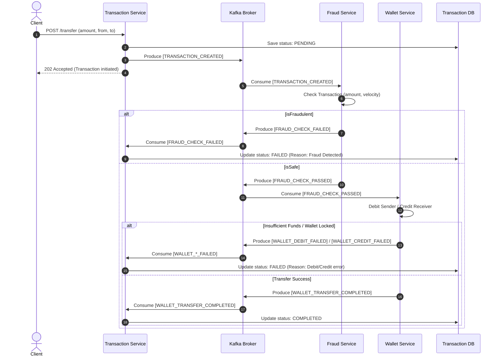

```mermaid
sequenceDiagram
    autonumber
    actor Client
    participant TS as Transaction Service
    participant K as Kafka Broker
    participant FS as Fraud Service
    participant WS as Wallet Service
    participant DB as Transaction DB

    Client->>TS: POST /transfer (amount, from, to)
    TS->>DB: Save status: PENDING
    TS->>K: Produce [TRANSACTION_CREATED]
    TS-->>Client: 202 Accepted (Transaction initiated)
    
    %% Step 1: Fraud Check
    K->>FS: Consume [TRANSACTION_CREATED]
    FS->>FS: Check Transaction (amount, velocity)
    alt isFraudulent
        FS->>K: Produce [FRAUD_CHECK_FAILED]
        K->>TS: Consume [FRAUD_CHECK_FAILED]
        TS->>DB: Update status: FAILED (Reason: Fraud Detected)
    else isSafe
        FS->>K: Produce [FRAUD_CHECK_PASSED]
        
        %% Step 2 & 3: Wallet Transfer
        K->>WS: Consume [FRAUD_CHECK_PASSED]
        WS->>WS: Debit Sender / Credit Receiver
        alt Insufficient Funds / Wallet Locked
            WS->>K: Produce [WALLET_DEBIT_FAILED] / [WALLET_CREDIT_FAILED]
            K->>TS: Consume [WALLET_*_FAILED]
            TS->>DB: Update status: FAILED (Reason: Debit/Credit error)
        else Transfer Success
            WS->>K: Produce [WALLET_TRANSFER_COMPLETED]
            K->>TS: Consume [WALLET_TRANSFER_COMPLETED]
            TS->>DB: Update status: COMPLETED
        end
    end
```
